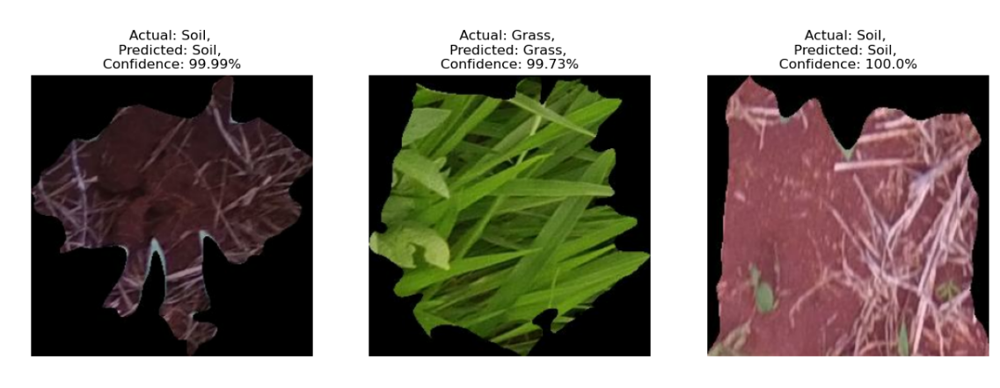
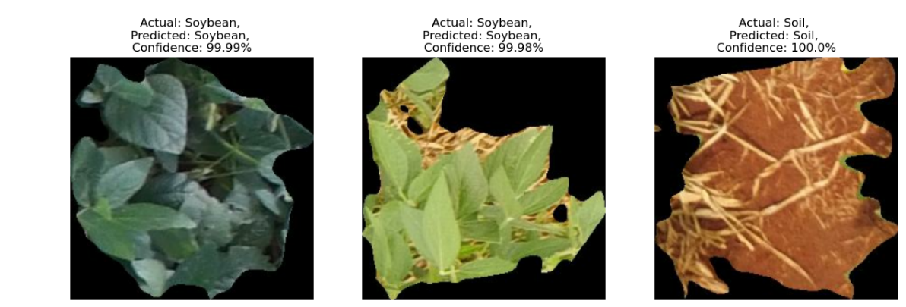

# Crop-vs-Weed-Detection

Overview
This project focuses on building a deep learning model to classify crop and weed images using Convolutional Neural Networks (CNN). The goal is to help automate agricultural processes by accurately identifying different plant types from images.

Dataset
The dataset used in this project is publicly available on Kaggle:
https://www.kaggle.com/datasets/ravirajsinh45/crop-and-weed-detection-data-with-bounding-boxes
Total images: ~16,800+
Classes: 9 categories (crop and weed types)
Image data used for multi-class classification

crop-weed-detection/
│
├── data/              # Sample images or dataset description
├── code/              # Jupyter Notebook (model training & evaluation)
├── results/           # Output images, graphs, confusion matrix
└── README.md

Approach
1. Data Loading & Preprocessing
Loaded images using TensorFlow dataset API
Resized images to 300x300
Normalized pixel values (0–1)
Split dataset:
80% Training
10% Validation
10% Testing
2. Data Augmentation
Random flipping (horizontal & vertical)
Random rotation
Helps improve model generalization
3. Model Architecture
Multiple Conv2D + MaxPooling layers
Fully connected Dense layers
Softmax output for multi-class classification
4. Training
Optimizer: Adam
Loss Function: Sparse Categorical Crossentropy
Epochs: 10
Batch Size: 32

Results
Training Accuracy: ~95.9%
Validation Accuracy: ~96.5%
Test Accuracy: ~96.8%
The model performs well across most classes with high precision and recall.

Evaluation
Confusion Matrix

Classification Report
Overall Accuracy: 97%
Strong performance on majority classes
Slight lower performance on minority classes (data imbalance)

Tech Stack
Python
TensorFlow / Keras
NumPy
Matplotlib
Seaborn
Scikit-learn

Key Learnings
Built an end-to-end deep learning pipeline for image classification
Applied data augmentation to improve performance
Evaluated model using confusion matrix and classification metrics
Understood challenges of class imbalance in image datasets

Future Improvements
Use transfer learning (ResNet, EfficientNet)
Hyperparameter tuning
Handle class imbalance more effectively
Deploy model using a web app (Streamlit / Flask)
